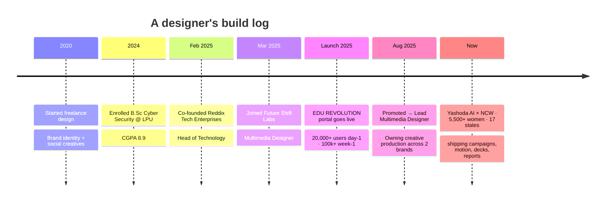

<!--
  ██████╗  ██████╗  ██████╗ ████████╗    ███████╗██╗   ██╗███████╗
  ██╔══██╗██╔═══██╗██╔═══██╗╚══██╔══╝    ██╔════╝╚██╗ ██╔╝██╔════╝
  ██████╔╝██║   ██║██║   ██║   ██║       ███████╗ ╚████╔╝ ███████╗
  ██╔══██╗██║   ██║██║   ██║   ██║       ╚════██║  ╚██╔╝  ╚════██║
  ██████╔╝╚██████╔╝╚██████╔╝   ██║       ███████║   ██║   ███████║
  ╚═════╝  ╚═════╝  ╚═════╝    ╚═╝       ╚══════╝   ╚═╝   ╚══════╝
                        booting abir.exe ...
-->

<div align="center">

<!-- ═══════════════ MONITOR FRAME :: POWER ON ═══════════════ -->


<!-- ═══════════════ TERMINAL PROMPT ═══════════════ -->

<a href="https://abirmahanta.studio">
  
</a>

<br/>


<a href="https://abirmahanta.studio"></a>
<a href="https://linkedin.com/in/itsmeabirmohanta"></a>


</div>

---

## `01` ▸ ./about.me

```ts
const abir = {
  role:        "Marketing Graphic Designer · Multimedia Designer",
  focus:       ["motion", "campaign assets", "brand systems"],
  experience:  "5+ years · client & in-house",
  currently:   "Lead Multimedia Designer @ Future Shift Labs",
  building:    "Reddix Tech Enterprises  (Co-Founder / Head of Tech)",
  studying:    "B.Sc (Hons.) Cyber Security & Forensics @ LPU  · CGPA 8.9",
  superpower:  "translating complex AI / policy / research into visuals people actually get",
  mode:        "production-speed, brand-consistent, always shipping ⚡",
};
```

<div align="center">

```
┌──────────────────────────────────────────────────────────────────────┐
│  >  loading portfolio journey ...                                    │
│  >  [██████████████████████████████████████████░░]  92%              │
│  >  ready.                                                           │
└──────────────────────────────────────────────────────────────────────┘
```

</div>

---

## `02` ▸ ./the.journey



---

## `03` ▸ ./workstations

<table width="100%">
<tr>
<td width="50%" valign="top">

### 🎨 &nbsp;`design.stack`


### 🎬 &nbsp;`motion.stack`


</td>
<td width="50%" valign="top">

### 🤖 &nbsp;`ai.workflows`


### 💻 &nbsp;`code.stack`


</td>
</tr>
</table>

---

## `04` ▸ ./capabilities

| Domain | What I ship |
|---|---|
| 📣 &nbsp;**Marketing Design** | LinkedIn creatives · carousels · ads · banners · landing page visuals · launch assets · emailer layouts |
| 🎯 &nbsp;**Brand & Layout** | Typography · visual hierarchy · brand guidelines · design systems · color systems · icon sets · illustrations |
| 🎥 &nbsp;**Motion & Video** | Promo videos · product videos · short-form · GIFs · lightweight motion graphics |
| 📖 &nbsp;**Editorial & Events** | Reports · whitepapers · case studies · presentations · brochures · posters · certificates |
| 🚀 &nbsp;**Product Comms** | SaaS + startup style storytelling · onboarding visuals · UI illustration · launch narratives |

---

## `05` ▸ ./featured.projects

<table>
<tr>
<td width="33%" valign="top" align="center">

### 🎓
**EDU REVOLUTION**
`portal · launch · LPU`

Centralized student achievement platform. Owned product comms & UI visuals.

`20,000+` users day-1
`100,000+` users week-1

</td>
<td width="33%" valign="top" align="center">

### 📚
**Prompt Library**
`AI · content · strategy`

Curated prompts for design, content, research & AI-assisted creative workflows.

`shipped` · `in use`

</td>
<td width="33%" valign="top" align="center">

### 🧠
**CPU Simulator**
`edu-tech · interactive`

Visual microprocessor learning platform — turns CPU ops into beginner-friendly flows.

`interactive learning`

</td>
</tr>
</table>

---

## `06` ▸ ./system.stats

<div align="center">


</div>

---

## `07` ▸ ./connect

<div align="center">

```
┌──────────────────────────────────────────────────────────┐
│  >  open to:  brand systems · motion · launch campaigns  │
│  >  reach:    dm on linkedin  ·  abirmahanta.studio      │
│  >  status:   ⚡ shipping                                 │
└──────────────────────────────────────────────────────────┘
```

<a href="https://abirmahanta.studio"></a>
<a href="https://linkedin.com/in/itsmeabirmohanta"></a>

<br/><br/>


</div>
